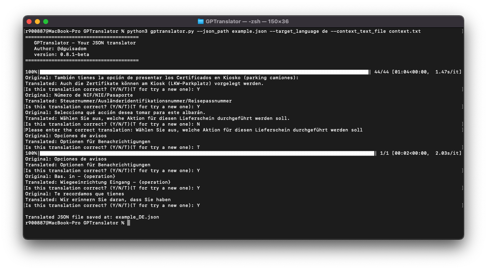

# GPTranslator

## Version [0.8.0-alpha]

GPTranslator is a command-line tool for translating JSON files, using the power of the OpenAI language model. The tool reads a JSON file, a target language, and a context description, and outputs a JSON file that has been translated into the target language.

## Features

- Command-Line Interface: GPTranslator is designed to be run from the console, making it easy to integrate into scripts and automated workflows.

- JSON Input: The tool reads a JSON file, recursively traversing the structure and translating all string values. It can handle JSON objects, arrays, and primitive types.

- Target Language: You can specify the target language for the translation using the ISO 639-1 code. GPTranslator supports all ISO 639-1 language codes.

- Contextual Translation: Along with the JSON file and target language, you can also provide a description of the technical context. This context can include the type of language, technical words, language context, and even forced translations or the meaning of specific acronyms. This helps ensure the accuracy of the translations.

- Prompt Injection Protection: GPTranslator is designed with protection against prompt injection, ensuring that the integrity of your input and output data is maintained.

In some languages, the translation of a word can change significantly depending on the context. For example, the word "load" could be translated differently in a logistics context compared to an electronics context. Thanks to the context prompt feature, you can instruct the model to take into account these differences in language.

## Usage

### How to run
Run GPTranslator from the command-line, providing the path to the JSON file, the target language, and the path to a .txt file containing the context description:

`python GPTranslator.py --json_path path/to/file.json --target_language ISO_639-1_code --context_text_file path/to/context.txt`

If you run GPTranslator without any arguments, it will prompt you to enter the necessary information:

`python GPTranslator.py`

You will be asked to provide:

- the path of the JSON file.
- The target language (ISO 639-1 code).
- The path to a .txt file containing context text for the translation.

When the translation ends, GPTranslator ask you to check translations that have a substantial length deviation from the original, based on the text_bias parameter

Finally, GPTranslator saves the JSON result on the same path than the original one.

### Context file

In order to improve the translation result, you have to explain the context as much as you can. Is a good point to explain it in the same language than the original json. By this way you are going to improve the result dramatically.

---
## Configuring OpenAI API Key

GPTranslator uses the OpenAI API chat completions for translate texts. Therefore, it requires an API key to work. If you do not have an API key, you can get one by signing up on the [OpenAI website](https://platform.openai.com/signup).

The API key should be stored in an environment variable called OPENAI_KEY. GPTranslator will try to read this environment variable. If it cannot find the OPENAI_KEY environment variable, it throw an error.

How to set an environment variable on different operating systems:

#### Unix/Linux/MacOS:

You can set an environment variable in Unix, Linux, or MacOS using the export command in the terminal:

`export OPENAI_KEY=your-api-key`

Replace your-api-key with your actual OpenAI API key. This will set the OPENAI_KEY environment variable for your current session. To make it permanent, you can add the export command to your shell profile file (usually ~/.bashrc, ~/.bash_profile, or ~/.zshrc).

#### Windows:

On Windows, you can set an environment variable through the system properties.

1. Open the System Properties dialog by right-clicking on Computer on the Desktop or in the Start menu, select Properties, then click Advanced system settings.

2. In the System Properties dialog, click Environment Variables.

3. In the Environment Variables dialog, click New under the User variables or System variables box (depending on whether you want to set the variable only for the current user or for all users), then enter OPENAI_KEY as the variable name and your actual OpenAI API key as the variable value.

After setting the OPENAI_KEY environment variable, you should be able to run GPTranslator without any API key errors.

## Installation

To install the necessary dependencies, run:

`pip install -r requirements.txt`

## Common issues

#### Unix/Linux/MacOS:

- **Urllib3 version error**: 
urllib3 v2.0 only supports OpenSSL 1.1.1+, currently the 'ssl' module is compiled with LibreSSL 2.8.3. 
See: https://github.com/urllib3/urllib3/issues/2168

## Requirements

- Python 3.6 or higher
- openai
- tqdm
- gnureadline

## Contributing

Pull requests are welcome. For major changes, please open an issue first to discuss what you would like to change.